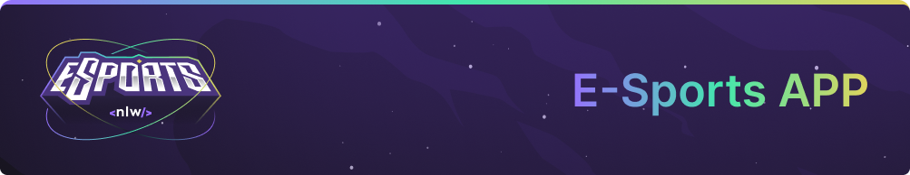

 

---

## About the project 🚀

This application is a study project, made by [Rocketseat](https://rocketseat.com/) on NLW E-Sports.

The application is a way to find a duo that likes and play the same game to play together, like a tinder of games but without the like system.

To learn more, i'll stablish some rules and steps to continue with the application (web, backend and mobile).

## Technologies 💻

This list contains all the technology used to create the application.

- [NodeJS](https://nodejs.org/)
- [Prisma](https://www.prisma.io/)
- [Typescript](https://www.typescriptlang.org/)
- [React](https://beta.reactjs.org/)
- [React Native](https://reactnative.dev/)
- [Expo](https://expo.dev/)
- [Radix UI](https://www.radix-ui.com/)
- [Tailwind](https://tailwindcss.com/)
- [Axios](https://axios-http.com/ptbr/docs/intro)

## Documentations 📂

For more detailed documentation, each of the projects has its own README.

- [Web Documentation](./web/README.md)
- [Backend Documentation](./backend/README.md)
- [Mobile Documentation](./mobile/README.md)

Good reading and, please, if you are interested in contributing to this project, let me know. Event if it is to give or share more ideas.

---

Made by 👩🏾‍💻 <a href="https://linkedin.com/in/jessicacastros">Jessica Castro</a> with 💙

