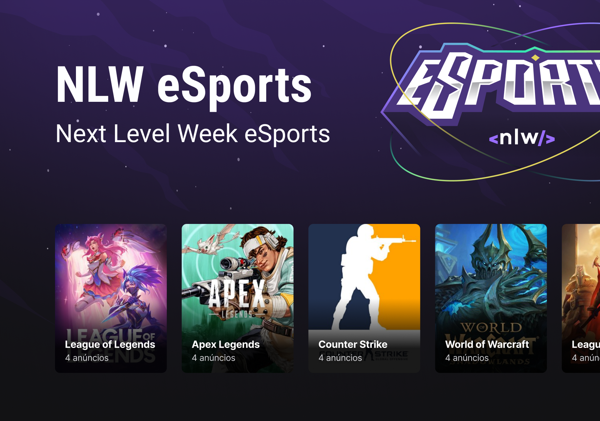

 

# E-Sports API - About the project 🚀

This project allows you to create advertisements for other players using the E-Sports API.

---

## Entities 👻

### Game 🕹️

List of itens on a game

- id
- name
- bannerURL

### Advertisements 🎯

List of itens on an ad

- id
- gameId
- name
- yearsPlaying
- discord
- weekDays
- hourStart
- hourEnd
- useVoiceChannel
- createdAt

## What this API can do? :pushpin:

- List of games with advertisements counts
- Create a new advertisement for a game
- List of advertisements by game
- Search discord by advertisement id

## Technologies 💻

- [NodeJS](https://nodejs.org/)
- [Express](https://expressjs.com/pt-br/)
- [Prisma](https://www.prisma.io/)
- [SQLite](https://www.sqlite.org/index.html)

--- 

Made by 👩🏾‍💻 <a href="https://linkedin.com/in/jessicacastros">Jessica Castro</a> with 💙
